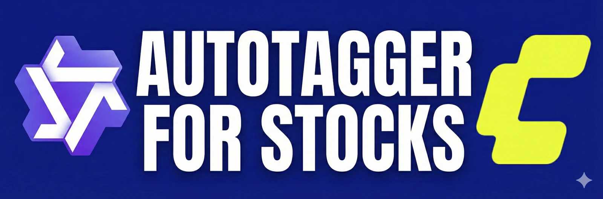
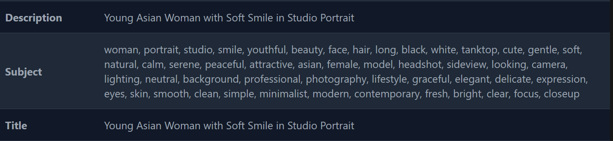
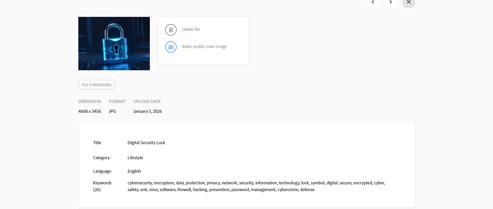
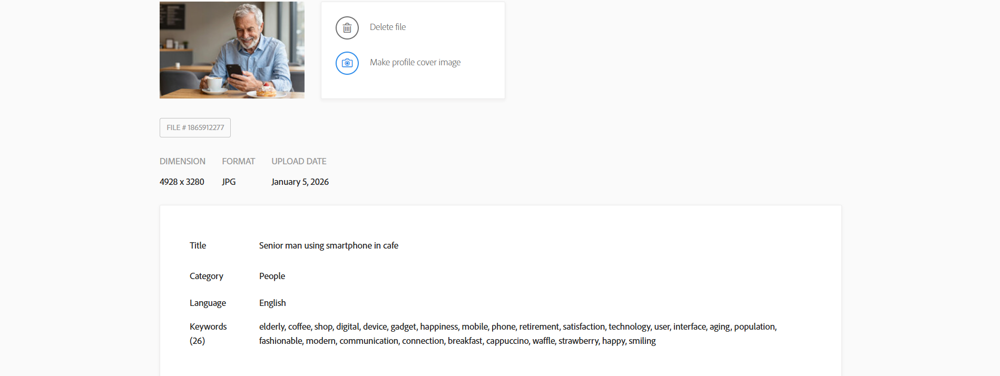
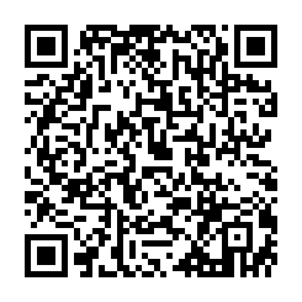

# Qwen3 VL AutoTagger CLI

[](https://boosty.to/ekkonwork/donate)
[](https://www.linkedin.com/in/mikhail-kuznetsov-14304433b)
[](https://colab.research.google.com/github/ekkonwork/qwen3-vl-autotagger-cli/blob/main/Colab_T4_CLI_Prod.ipynb)



Standalone CLI version of Qwen3-VL AutoTagger: generate Adobe Stock-style title + keywords and optionally embed XMP metadata into saved images.

## ComfyUI Node Version

Need the same tagging pipeline directly inside ComfyUI? Use the node project:

[](https://github.com/ekkonwork/comfyui-qwen3-autotagger)
[](https://github.com/ekkonwork/comfyui-qwen3-autotagger/tree/main/example_workflows)

## Colab (Production)

Use the production notebook with one-click Colab launch:

- `Colab_T4_CLI_Prod.ipynb`: run tagging with XMP enabled by default and output download.

## Highlights

- Works without ComfyUI
- Processes a single image or a whole folder
- Saves tagged images with XMP metadata when `--write-xmp` is enabled
- Writes metadata JSONL report (`output_dir/metadata.jsonl` by default)
- Supports auto-download of `Qwen/Qwen3-VL-8B-Instruct` on first run
- Optional 4-bit quantization on CUDA

## Screenshots

Embedded XMP Metadata


Adobe Stock Result Example 1


Adobe Stock Result Example 2


## Quick Start

1. Clone repository:

```bash
git clone https://github.com/ekkonwork/qwen3-vl-autotagger-cli
cd qwen3-vl-autotagger-cli
```

2. Install dependencies:

```bash
pip install -r requirements.txt
```

3. Install `exiftool` (required only if `--write-xmp` is enabled):
   - Linux: `python install.py` (uses `apt-get`)
   - macOS: `brew install exiftool`
   - Windows: `choco install exiftool`

4. Run:

```bash
python -m qwen3_vl_autotagger_cli.cli "C:/images" --recursive --output-dir "C:/images_tagged"
```

## CLI Usage

```bash
qwen3-vl-autotagger INPUT_PATH [options]
```

Main options:

- `--recursive`: recursively scan folders
- `--write-xmp / --no-write-xmp`: enable/disable XMP embedding
- `--require-exiftool / --no-require-exiftool`: fail or skip when `exiftool` is missing
- `--output-dir`, `--output-format`, `--file-prefix`
- `--metadata-jsonl`: metadata JSONL output path
- `--model-id`: HF model id (default `Qwen/Qwen3-VL-8B-Instruct`)
- `--auto-download / --no-auto-download`
- `--local-model-path`: local model folder for offline usage
- `--load-in-4bit / --no-load-in-4bit`
- `--min-pixels`, `--max-pixels`, `--allow-resize / --no-allow-resize`
- `--max-keywords`, `--attempts`, `--temperature`, `--top-p`, `--repetition-penalty`

Examples:

```bash
# Folder batch, write XMP + JSONL
python -m qwen3_vl_autotagger_cli.cli "./images" --recursive --output-dir "./outputs"

# Single image, metadata only (no saved output image)
python -m qwen3_vl_autotagger_cli.cli "./images/photo.jpg" --no-write-xmp --metadata-jsonl "./report.jsonl"

# Local model only (no download)
python -m qwen3_vl_autotagger_cli.cli "./images" --no-auto-download --local-model-path "D:/models/Qwen3-VL-8B-Instruct"
```

## Output Behavior

- When `--write-xmp` is enabled, CLI saves tagged images and embeds XMP metadata.
- Saved filenames are auto-incremented (`file_prefix_00000`, `file_prefix_00001`, ...) and existing files are not overwritten.
- Metadata JSONL is written for each processed image (`input_path`, `output_path`, `title`, `keywords`, `json`).

## Model Download Size

By default (`--auto-download`), the CLI downloads `Qwen/Qwen3-VL-8B-Instruct` on first run.
The download size is about 17.5 GB of weights in total (roughly 16.3 GiB).

## Performance

On a Colab T4, a single image typically takes about 60 seconds to auto-tag (varies with resolution and settings).

## Troubleshooting (Environment)

- `exiftool` may be missing or not available in `PATH`.
- CUDA/driver/VRAM setup can differ between machines.
- `bitsandbytes` may fail to install or initialize on some systems.
- If you see `Qwen3VLForConditionalGeneration is not available`, reinstall dependencies:
  - `pip uninstall -y transformers qwen-vl-utils`
  - `pip install -U git+https://github.com/huggingface/transformers`
  - `pip install -U qwen-vl-utils accelerate bitsandbytes`
- Hugging Face (`HF`) downloads can be unstable due to network/rate limits.

## Support

If this project saves you time, you can support development on Boosty:

[](https://boosty.to/ekkonwork/donate)

[](https://boosty.to/ekkonwork/donate)

- Boosty (donate): `https://boosty.to/ekkonwork/donate`

### Crypto Donations (Telegram Wallet)

[](#crypto-donations-telegram-wallet)
[](https://t.me/wallet)



Scan this QR code in your wallet app to copy the donation address:

- TON: `UQAMPvqduXVWyax325-zqk81rTwNG1bRhCvXPyIs7eeIxEVp`
- USDT (TON): `UQAMPvqduXVWyax325-zqk81rTwNG1bRhCvXPyIs7eeIxEVp`
- Memo/Tag: check the Wallet receive screen before sending.

## Hire Me

[](https://www.linkedin.com/in/mikhail-kuznetsov-14304433b)

[](https://www.linkedin.com/in/mikhail-kuznetsov-14304433b)

- English: `B2` (text-first communication).
- Hiring (full-time/long-term): prefer written communication; for live calls, Russian-speaking teams are preferred.
- Project work: open to worldwide async collaboration.
- Email: `ekkonwork@gmail.com`
- Telegram: `@Mikhail_ML_ComfyUI`
- LinkedIn: `https://www.linkedin.com/in/mikhail-kuznetsov-14304433b`
- Boosty: `https://boosty.to/ekkonwork/donate`

## License

MIT. See `LICENSE`.
